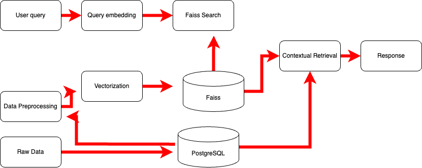

# **Data Pipeline for Structured and Unstructured Data with Vector Search and RAG**

## **Project Overview**

This project implements a comprehensive data pipeline to handle both structured and unstructured data. The pipeline performs the following tasks:

1. **Data Ingestion**: Load data from JSON and CSV files into a PostgreSQL database with an optimized schema.
2. **Data Preprocessing**: Clean and transform the data for efficient storage and retrieval.
3. **Vectorization**: Convert unstructured text data into embeddings using a pre-trained language model and store them in a Faiss index.
4. **Query and Retrieve**: Provide an API to query the vector store and retrieve similar records from the database, implementing Retriever-Augmented Generation (RAG).
5. **Documentation**: Document the code, design choices, and trade-offs.
6. **Bonus**: Implement logging and optimize the pipeline for scalability.

---

## **Architecture**



---

## **Setup Instructions**

### **Prerequisites**

- Python 3.7 or higher
- PostgreSQL database

### **Configure the Database**

   - Ensure PostgreSQL is installed and running.
   - Create a new database:

     ```sql
     CREATE DATABASE yourdbname;
     ```

   - Update the database configuration in `config.py`:

     ```python
     # config.py

     db_config = {
         'dbname': 'yourdbname',
         'user': 'yourdbuser',
         'password': 'yourdbpassword',
         'host': 'localhost',
         'port': 5432
     }
     ```

### **Prepare the Data**

   - Place your datasets in the `data/` directory:

     ```
     data/
     ├── customer_reviews.json
     └── medical_records.csv
     ```

---

## **Code Structure**

```
project/
├── api/
│   ├── app.py
│   └── config.py
├── tests/
│   └── test_rag.py
├── data/
│   ├── customer_reviews.json
│   └── medical_records.csv
├── logs/
│   └── pipeline.log
├── vector_store/
│   └── faiss_index
├── data_ingestion.py
├── data_preprocessing.py
├── vectorization.py
├── query_retrieve.py
├── pipeline.py
├── requirements.txt
└── README.md
```

- **api/**: Contains the Flask API and RAG codes.
- **logs/**: Test similarity search and RAG using pretrained models.
- **data/**: Contains the input datasets.
- **logs/**: Stores the pipeline logs.
- **vector_store/**: Stores the Faiss index files.
- **data_ingestion.py**: Script for data ingestion.
- **data_preprocessing.py**: Script for data preprocessing.
- **vectorization.py**: Script for vectorizing text data.
- **query_retrieve.py**: Script for querying and retrieving data.
- **pipeline.py**: Orchestrates the entire data pipeline.
- **requirements.txt**: Lists all Python dependencies.
- **README.md**: Project documentation.

---

## **Design Choices and Trade-offs**

### **Database Selection**

**Choice**: **PostgreSQL**

**Reasoning**:

- **Robustness**: PostgreSQL is a powerful, open-source object-relational database system known for its stability and reliability.
- **Complex Queries**: Supports advanced querying capabilities, essential for retrieving data based on complex criteria.
- **Scalability**: Handles large volumes of data efficiently.

**Trade-offs**:

- **Complexity**: Requires setup and maintenance compared to simpler databases like SQLite.
- **Resource Intensive**: Might be overkill for small datasets or simple applications.

### **Schema Design**

**Customer Reviews Table**:

- **Fields**: `review_id`, `timestamp`, `rating`, `verified_purchase`, `product_id`, `category`, `price`, `brand`, `review_text`, `age_group`, `location`, `purchase_history_count`

**Medical Records Table**:

- **Fields**: `patient_id`, `age`, `gender`, `blood_type`, `visit_date`, `vital_signs`, `symptoms`, `doctor_notes`

**Design Considerations**:

- **Normalization**: Flattened nested JSON structures to avoid complex joins and improve query performance.
- **Indexing**: Primary keys on `review_id` and `patient_id` for fast lookups.

**Trade-offs**:

- **Denormalization**: Could lead to redundant data but improves read performance.
- **Flexibility vs. Complexity**: A more normalized schema might be flexible but adds complexity to queries.

### **Data Preprocessing**

**Techniques**:

- **Text Cleaning**: Lowercasing, removing special characters, and extra spaces.
- **Data Type Conversion**: Ensuring correct data types for each field.
- **Handling Missing Values**: Filling or removing missing data as appropriate.

**Design Choices**:

- **Batch Processing**: Processing data in batches to handle large datasets efficiently.
- **Error Handling**: Implemented robust error handling to ensure pipeline resilience.

**Trade-offs**:

- **Processing Time**: More thorough cleaning can increase processing time.
- **Data Loss**: Aggressive cleaning might remove useful information.

### **Vectorization and Vector Store**

**Model Choice**: **SentenceTransformer's `all-MiniLM-L6-v2`**

**Reasoning**:

- **Performance**: Strikes a balance between speed and accuracy.
- **Resource Efficient**: Smaller model size suitable for machines without high-end GPUs.

**Vector Store Choice**: **Faiss**

**Reasoning**:

- **Efficiency**: Optimized for similarity search and clustering of dense vectors.
- **Scalability**: Handles large datasets efficiently.

**Trade-offs**:

- **Complexity**: Requires understanding of Faiss API.
- **Alternative Tools**: Could have used tools like Annoy or Milvus, but Faiss offers better performance for our use case.

### **API Framework**

**Choice**: **Flask**

**Reasoning**:

- **Lightweight**: Ideal for building simple APIs quickly.
- **Community Support**: Large community and extensive documentation.
- **Flexibility**: Easy to integrate with other Python code.

**Trade-offs**:

- **Performance**: Not as performant as some other frameworks like FastAPI for high-load applications.
- **Asynchronous Support**: Limited compared to frameworks designed for async operations.

### **Retriever-Augmented Generation (RAG)**

**Implementation**:

- **Approach**: Retrieve relevant documents and use them as context for generating responses with a language model.
- **Model**: Placeholder for language generation model (e.g., GPT-3.5, or local alternatives).

**Trade-offs**:

- **Latency**: Additional computation can increase response time.
- **Complexity**: Integrating language models adds complexity to the system.

### **Scalability and Performance**

**Techniques**:

- **Batch Processing**: Used in data preprocessing and vectorization to manage memory usage.
- **Logging**: Implemented logging to monitor the pipeline and identify bottlenecks.
- **Resource Management**: Adjusted batch sizes based on system capabilities.

**Trade-offs**:

- **Memory Usage**: Larger batch sizes reduce overhead but increase memory usage.
- **Processing Time**: Smaller batches are safer but may increase total processing time.

---

## **Usage**

### **Running the Pipeline**

Execute the entire pipeline using `pipeline.py`:

```bash
python pipeline.py
```

- **Data Ingestion**: Ingests data from `data/` into the PostgreSQL database.
- **Data Preprocessing**: Cleans and preprocesses the data.
- **Vectorization**: Generates embeddings and builds the Faiss index.

### **Starting the API**

Navigate to the `api/` directory and run the Flask application:

```bash
cd api/
python app.py
```

- The API will start on `http://localhost:5001`.

### **Querying the API**

Send a POST request to the `/query` endpoint with a JSON payload:

### **Retriever-Augmented Generation (RAG)**

**Implementation Details**:

- **Model Choice**: **gpt3.5 turbo**
  
- **Architecture**:
  - **Two-Stage Process**:
    1. Vector Similarity Search: Retrieves relevant documents using FAISS
    2. Context-Enhanced Generation: Uses retrieved documents to generate responses

- **Context Processing**:
  ```python
  retrieved_texts = ' '.join([
      ' '.join(filter(None, [
          res['data'].get('symptoms'),
          res['data'].get('doctor_notes'),
          res['data'].get('review_text')
      ]))
      for res in results
  ])
  ```
  
- **Prompt Structure**:
  ```python
  prompt = f"Context: {retrieved_texts}\nQuestion: {query_text}\nAnswer:"
  ```

**Trade-offs**:
- **Local Model vs. API-based Models**:
  - **Pros**: No API costs, faster response times, offline capability
  - **Cons**: Lower quality responses compared to GPT-3.5/4
- **Context Window Size**:
  - Limited to model's maximum context length
  - May need to truncate long retrieved texts
- **Response Quality vs. Speed**:
  - Balanced through parameter tuning (max_length, num_return_sequences)

### **Testing Framework**

**Test Implementation**:

1. **Unit Tests** (`test_rag.py`):
   ```python
   def test_query(query_text, top_k=3):
       """Test the query API endpoint"""
       url = "http://localhost:5001/query"
       payload = {
           "query": query_text,
           "top_k": top_k
       }
       # ... test implementation
   ```

2. **Test Cases**:
   - Basic query functionality
   - Response format validation
   - Error handling scenarios

**Test Scenarios**:

1. **Customer Reviews Queries**:
   ```bash
   # Example test command
   python test_api.py "What are common complaints about shipping?"
   ```

2. **Medical Records Queries**:
   ```bash
   # Example test command
   python test_rag.py "Find patients with fever symptoms"
   ```

**Testing Considerations**:

- **Coverage**:
  - Vector similarity search accuracy
  - RAG response generation
  - Error handling paths
  - API endpoint functionality

- **Performance Testing**:
  - Response time monitoring
  - Memory usage tracking
  - Batch processing efficiency

**Example Test Output**:
```
Sending query: What are common complaints about shipping?
Table Type: customer_reviews
==================================================

Generated Answer:
----------------------------------------
Since there is no specific review provided to analyze, I cannot determine any common complaints about shipping based on the information given. If you could provide a review with details regarding shipping, I would be able to identify any common complaints related to that aspect.
----------------------------------------

Retrieved Results:

Result 1:
ID: P141323
Distance: 1.2847
Table: medical_records
{'age': 58,
 'blood_type': 'O+',
 'doctor_notes': 'Reason draw second personal carry. Fly significant receive '
                 'be. Three weight probably white poor war.\n'
                 'Rate store themselves. Rest environment talk star remain.',
 'doctor_notes_cleaned': 'reason draw second personal carry fly significant '
                         'receive be three weight probably white poor war rate '
                         'store themselves rest environment talk star remain',
 'gender': 'M',
 'patient_id': 'P141323',
 'symptoms': 'Nausea',
 'symptoms_cleaned': 'nausea',
 'visit_date': 'Wed, 30 Oct 2024 17:43:06 GMT',
 'vital_signs': 'BP:155/73,Temp:97.9F,Pulse:63'}
----------------------------------------

Sending query: Find patients with fever symptoms
Table Type: medical_records
==================================================

Generated Answer:
----------------------------------------
Based on the medical records provided, patients with fever symptoms are identified in Records 1, 2, 3, and 4. Fever is a common symptom present in all four records. In Record 3, the patient also experiences dizziness in addition to fever. Each record contains notes from the respective doctor visits, which may provide further insight into the patient's condition and potential treatments.
----------------------------------------

Retrieved Results:

Result 1:
ID: P150955
Distance: 0.9966
Table: medical_records
{'age': 79,
 'blood_type': 'B-',
 'doctor_notes': 'Thing involve near throw strategy culture build foot. '
                 'Financial product free memory stand camera detail.',
 'doctor_notes_cleaned': 'thing involve near throw strategy culture build foot '
                         'financial product free memory stand camera detail',
 'gender': 'F',
 'patient_id': 'P150955',
 'symptoms': 'Fever',
 'symptoms_cleaned': 'fever',
 'visit_date': 'Mon, 07 Oct 2024 00:58:15 GMT',
 'vital_signs': 'BP:131/70,Temp:99.5F,Pulse:86'}
----------------------------------------

Result 2:
ID: P652719
Distance: 1.0185
Table: medical_records
{'age': 39,
 'blood_type': 'B+',
 'doctor_notes': 'Pattern arrive still possible five. Future officer drive '
                 'rest free management. Back dinner every own weight someone '
                 'young.',
 'doctor_notes_cleaned': 'pattern arrive still possible five future officer '
                         'drive rest free management back dinner every own '
                         'weight someone young',
 'gender': 'M',
 'patient_id': 'P652719',
 'symptoms': 'Fever',
 'symptoms_cleaned': 'fever',
 'visit_date': 'Sat, 05 Oct 2024 03:02:53 GMT',
 'vital_signs': 'BP:113/84,Temp:98.3F,Pulse:81'}
----------------------------------------

Result 3:
ID: P270167
Distance: 1.0465
Table: medical_records
{'age': 40,
 'blood_type': 'A-',
 'doctor_notes': 'Later church company that station.\n'
                 'Him within national continue similar computer land.',
 'doctor_notes_cleaned': 'later church company that station him within '
                         'national continue similar computer land',
 'gender': 'F',
 'patient_id': 'P270167',
 'symptoms': 'Fever,Dizziness',
 'symptoms_cleaned': 'feverdizziness',
 'visit_date': 'Sat, 05 Oct 2024 19:23:20 GMT',
 'vital_signs': 'BP:113/88,Temp:98.5F,Pulse:68'}
----------------------------------------

Result 4:
ID: P266158
Distance: 1.0695
Table: medical_records
{'age': 72,
 'blood_type': 'O+',
 'doctor_notes': 'Interview western continue character unit according. Answer '
                 'research ball agency class early the.',
 'doctor_notes_cleaned': 'interview western continue character unit according '
                         'answer research ball agency class early the',
 'gender': 'F',
 'patient_id': 'P266158',
 'symptoms': 'Fever',
 'symptoms_cleaned': 'fever',
 'visit_date': 'Thu, 24 Oct 2024 13:52:59 GMT',
 'vital_signs': 'BP:125/62,Temp:99.3F,Pulse:95'}
----------------------------------------
```

**Test Script Usage**:
```bash
# Run basic tests
python test_rag.py

# Run specific test cases
python test_rag.py "custom query text"
```

### **Monitoring and Validation**

1. **Logging**:
   - Query performance metrics
   - RAG generation timing
   - Error tracking
   - Resource usage

2. **Quality Assurance**:
   - Response relevance validation
   - Retrieved context appropriateness
   - Generated response coherence
---

# **Appendix**

## **Thought Process and Design Decisions**

### **Why Use a Pre-trained Language Model?**

- **Efficiency**: Leveraging a pre-trained model saves time and computational resources compared to training from scratch.
- **Accuracy**: Pre-trained models have been trained on large corpora and provide state-of-the-art performance.

### **Why Faiss for Vector Storage?**

- **Performance**: Optimized for handling large-scale similarity search efficiently.
- **Community and Support**: Developed by Facebook AI Research with active community support.

### **Handling of Unstructured Data**

- **Text Fields**: Focused on fields like `review_text`, `symptoms`, and `doctor_notes` for vectorization.
- **Cleaning and Preprocessing**: Essential to ensure the quality of embeddings and, consequently, the retrieval results.


---

## **Potential Challenges and Solutions**

- **Challenge**: **Large Dataset Handling**

  - **Solution**: Implemented batch processing and optimized queries to handle data without exceeding memory limits.


